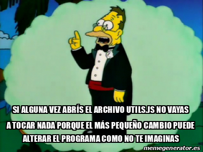

# TP - AsteroidJS

## Introducción

Al día de hoy y con los continuos avances en cuanto a desarrollo web, todas la versiones del clásico juego Asteroid (podés probarlo [acá https://arcade.ly/games/asteroids](https://arcade.ly/games/asteroids/)) han quedado fuera de servicio debido a su falta de mantenimiento y actualización. Ciertamente aparecieron nuevas versiones pero son pagas o con limitaciones para su versión gratuita lo que claramente no es justo ya que se trata de un juego del año 1979, que al día de hoy debería ser de dominio publico. 

Pues bien, queda a nuestro cargo completar la construcción de una versión totalmente libre para quien quiera probarlo.

[](https://www.youtube.com/watch?v=whXHjzHkEtg)

En este desafió usaremos algunos conceptos muy importante para la programación tales como:

- Funciones.
- Procedimientos.
- Variables Globales.
- Variables Locales. 

> Nota: vale la pena decir que el uso de variables globales es una pésima practica dentro de la programación, pero es importante entender el concepto de scope o alcance de una variable para poder ser mejores programadores y generar aplicaciones de gran calidad.


## ¿Cómo copio el código para empezar a trabajar?

**A.** Para copiar el código que te damos hecho tenés que ingresar acá https://repl.it/ e iniciar sesión con tu cuenta.

**B.** Si alguno de tus compañeros YA creó el proyecto para trabajar con este TP, solo debés abrirlo y empezar a trabajar.

**CONTINUAR CON LOS PASOS A CONTINUACIÓN SOLO SI NINGÚN COMPAÑERO DE TU GRUPO CREO EL PROYECTO**

**C.** Si estás en este punto es porque ningún compañero de tu grupo creó el proyecto, en ese caso tenés que seguir [este video](https://web.microsoftstream.com/video/b026685c-5f33-457e-a940-67007ddab0b0?st=106). **El link del repositorio que necesitás para esta actividad es: https://github.com/joaquinbf/AP3-AsteroidJS**

**D. No te olvides de invitar a los compañeros de tu grupo**. Para hacer esto debés hacer click en share y buscar los usuarios de sus cuentas, o hacer click en `copy link` y compartírselos.

**E. Compartile el proyecto a tu profesor así lo puede corregir**. Para hacer esto debés hacer click en share y buscar la cuenta de tu profesor. Para **3º B** es **JoaquinBlanco** y para **3º D** es **smschachtner**.

**F.** Por último te pedimos que le **cambies el nombre al proyecto** así están todos ordenados y los podemos encontrar más fácil.

Esto se logra haciendo click en el lápiz que está cerca de tu nombre de usuario en `repl.it` (arriba a la izquierda en la pantalla).

Los nombres de los proyectos tienen que ser así: `xxxx-AP3-Gyy-TPzz`

Donde `xxxx` corresponde al año, `yy` es el número de grupo y `zz` es el número de TP.

Por ejemplo, para el TP 3 del grupo 5 sería: 2020-AP3-G05-TP03

**No, sólo tenés que trabajar en `main.js` y `respuestas.md`**... pero a continuación te contamos los detalles de cada uno.

- `main.js`: es el archivo de código principal, acá vas a tener que ir resolviendo el código que te pidamos.
- `respuestas.md`: es un archivo de texto donde tenés que responder los puntos que sólo hacen preguntas y NO piden código.
- `README.md`: es este archivo que estás viendo, donde está el enunciado. Te recomendamos que NO lo abras desde `repl.it`porque puede hacer que se vea mal, conviene acceder directamente desde el link que te damos en la tarea de Teams.
- Carpeta `img`: ahí pusimos las imágenes que usa el programa.
- Carpeta `src`: se encuentra todo lo que hasta el momento se desarrollo para el juego. **NO tenés que modificarlo y recordá el consejo que le dió el abuelo a Homero el día de su casamiento.**



## Herramientas utilizadas

Para la construcción del juego no estamos utilizando P5, sino JavaScript Puro, por lo que gran cantidad de operaciones están resueltas y disponibles para continuar con el desarrollo.

- Procedimientos disponibles para controlar la nave.
  - `disparar()`
  - `girarALaIzquierda()`
  - `girarALaDerecha()`
  - `avanzar()`
  - `detener()`
  - `posicionEnXDeLaNave()`
  - `posicionEnYDeLaNave()`
  - `colocarALaNaveEnX(posicion)`
  - `colocarALaNaveEnY(posicion)`
- Procedimientos y/o funciones para gestionar balas.
  - `posicionEnXDeLaBala(bala)`: recibe una bala y devuelve su posición en el eje `X`.
  - `posicionEnYDeLaBala(bala)`: recibe una bala y devuelve su posición en el eje `Y`.
  - `reutilizarBala(bala)`: recibe una bala y la deja lista para ser reutilizada por la nave.
- Funciones para colisiones.
  - `chocaron(a, b)`: recibe dos OBJETOS (que pueden balas, naves o asteroides) y devuelve `true` si estos colisionaron. 
  - `asteroideIEsimo(idAsteroide)`: recibe el id de un asteroide y devuelve el OBJETO asteroide correspondiente.
  - `balaIEsima(idBala)`: recibe el id de una bala y devuelve el OBJETO bala correspondiente
  - `destruirAsteroide(asteroide)`
- Procedimientos para actualizar los puntos
  - `actualizarCartelPuntos()`

## Resuelva

> Siempre utilice los comentarios y la identación adecuada.

1. Queremos controlar la nave principal. Para esto tendremos que utilizar los siguientes datos

   - `keyCode`: es un código numérico que se le asigna a cada tecla del teclado para identificarlo y que las aplicaciones puedan detectar qué tecla fue presionada o soltada.
   - `keyLeft`: es una variable global que debe valer `true` si las teclas [A] o [&larr;] fueron presionadas, y `false` en otros casos
   - `keyRight`: es una variable global que debe valer `true` si las teclas [D] o [&rarr;] fueron presionadas, y `false` en otros casos
   - `keyUp`: es una variable global que debe valer `true` si las teclas [W] o [&uarr;] fueron presionadas, y `false` en otros casos
   - `keySpace`: es una variable global que debe valer `true` si las teclas [ESPACIO] o [K] fueron presionadas, y `false` en otros casos

   Deben crear dos procedimientos:

   - `teclasPresionadas`: debe recibir a `keyCode` como parámetro y asignar `true` a las variables `keyLeft, keyRight, keyUp, keySpace` de acuerdo al valor de `keyCode` recibido. 
   - `teclasSoltadas`: debe recibir a `keyCode` como parámetro y asignar `false` a las variables `keyLeft, keyRight, keyUp, keySpace` de acuerdo al valor de `keyCode` recibido. 

   En ambos casos, en cuanto se detecte un código, el procedimiento debe asignar el valor correspondiente y terminar.

   Estos son los códigos de las teclas:

   | Tecla   | Código |
   | ------- | ------ |
   | `A`     | 65     |
   | &larr;  | 37     |
   | `W`     | 87     |
   | &uarr;  | 38     |
   | `D`     | 68     |
   | &rarr;  | 39     |
   | `K`     | 75     |
   | ESPACIO | 32     |

   - ACLARACIÓN: en ningún momento mencionamos hacer nada si se presiona con la tecla abajo &darr; porque la nave se frenará sola cuando dejemos de presionar la tecla &uarr;.

2. Ahora que ya sabés que variables globales sirven para controlar la nave, tenés que crear el procedimiento `controlarLaNave()` que, obviamente, accione los movimientos de la nave según el valor de `keyUp, keyRight, keyLeft, keySpace`

   - AYUDA: cuando la variable global `keyUp` valga `true`: ¿qué debería hacer la nave? ¿y cuando valga `false`?

3. Pero, un momento, la nave se va de la ventana y desaparece de nuestra vista. ¡¡¡Esto no puede ser!!! Es importante dar la impresión de que el universo es grande y para eso debemos crear un procedimiento llamado `agujeroDeGusano()` que:

   - Cuando la nave desaparezca por la izquierda, reaparezca en el lado derecho.
   - Cuando la nave desaparezca por la derecha, reaparezca en el lado izquierdo.
   - Cuando la nave desaparezca por abajo, reaparezca arriba.
   - Cuando la nave desaparezca por arriba, reaparezca abajo.

   Algunos datos que debemos usar:

   - Existe una variable global llamada `screenWidth` que representa el ancho de la ventana. 
   - Existe una variable global llamada `screenHeight` que representa el alto de la ventana.

   Ahora si, algunas ayudas:

   - AYUDA: ¿Cuál es la posición en el eje `X` de la nave cuando desaparece por el lado derecho? y cuando se desaparece por el lado izquierdo?

4. Una vez que podemos empezar a disparar, lo más probable es que las balas se agoten o que la memoria RAM se nos termine por la cantidad de balas que creamos (nada es gratis). Una solución posible es recargar nuestras municiones con las balas que se van de la ventana, porque después de todo, no se ven. Entonces, hay que crear un procedimiento llamado `recargar(bala)` que reciba por parámetro una bala y dependiendo de su posición, ¡¡¡reutilizarla!!!

5. Bien, ya tenemos balas y tenemos asteroides, ahora nos falta programar las colisiones y sus consecuencias. Para identificar a cada munición y asteroide existente en el juego, se les asigno un numero que funciona como identificador. Pues bien, crear un procedimiento llamado `detectarColisionBalaAsteroide(idBala, idAsteroide)` que recibe como parámetro el identificador (número) de un asteroide y el identificador de una bala en particular. En el caso que los **OBJETOS** bala y asteroide correspondientes a esos identificadores hayan chocado... pues bien, ya podrás imaginar lo que tiene que pasar.

   - ACLARACIÓN: Si estabas atento habrás visto que mencionamos la palabra **OBJETO**. Entender y usar correctamente objetos es muy útil en programación. Por ahora nos alcanza con pensar que cada objeto es un **conjunto de datos** (generalmente más de 1) sobre el cual podemos realizar acciones.  Un ejemplo rápido: la nave es un objeto que tiene entre sus datos su posición en `X` e `Y`, pero además puede hacer algunas acciones como avanzar, disparar, etc.

   - AYUDA: ¿Cómo "creo" un objeto para usarlo? De la misma forma que creas variables, usando `var` o `let`.
   Ejemplo:

   ```javascript
   var nave;  //acá pedimos espacio en memoria para guardar una nave como si fuese una variable
              //(AUNQUE YA SABEMOS QUE GUARDARÁ UN OBJETO)
   nave = necesitoUnaNavePorFavor();    //la función necesitoUnaNavePorFavor() se encarga de conseguirnos
                                        //una nave para guardarla en nuestra memoria
   ```

   - AYUDA: ¿Quién se encarga de darnos un objeto `bala` y un objeto `asteroide`? Para eso te dimos la función  `balaIEsima(idBala)` y `asteroideIEsimo(idAsteroide)`. Recordá que ambas necesitan saber el identificador de la bala o asteroide que estás buscando.

   - AYUDA: No te olvides de reutilizar las balas.

6. Por otro lado, cuando finalmente destruimos un asteroide, es importante sumar una cierta cantidad de puntos. Para eso debemos usar una variable global `points` e incrementarla según la cantidad de puntos que consideremos merecer por aniquilar un asteroide que casi destruye la tierra. 

   - AYUDA: la variable `points` ya fue creada, solo debés usarla.

   - AYUDA: no te olvides de ejecutar la función `actualizarCartelPuntos()`.

   - AYUDA: el mensaje con los puntos aparecerá arriba a la izquierda de tu pantalla.


7. Veamos si entendimos algunas cosas importantes de este desafío.
   - ¿Cuál dirías que es la diferencia entre un procedimiento y una función? 
   - ¿Cómo hacer para que una funcion y/o procedimiento finalice su ejecución sin haber pasado por todas sus sentencias?


8. En cuanto a alcance de las variables:
   - ¿Cuál es la diferencia entre variables locales y globales?
   - ¿Por qué es una mala practica crear variables globales?


